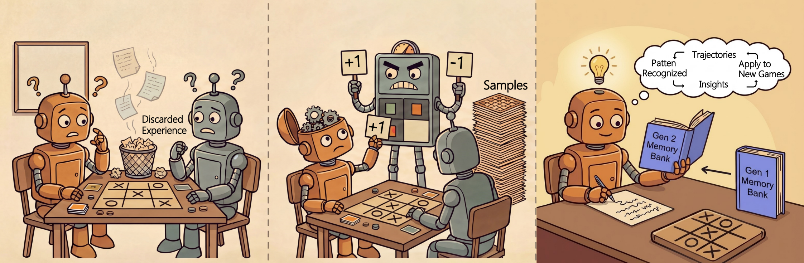

<div align="center">

<h1 style="font-size: 3em; font-weight: bold; margin: 0; border: none; padding: 0;">MEMO</h1>

**Memory-Augmented Model Context Optimization for Robust Multi-Turn Multi-Agent LLM Games**

[Yunfei Xie](https://yunfeixie233.github.io/)<sup>*,1</sup>,
[Kevin Wang](https://www.kevin-ai.com/)<sup>*,+,2</sup>,
[Bobby Cheng](https://x.com/bobbycxy)<sup>*,4</sup>,
[Jianzhu Yao](https://scholar.google.com/citations?user=L5XDYTIAAAAJ&hl=en)<sup>3</sup>,
[Zhizhou Sha](https://jamessand.github.io/)<sup>2</sup>,
[Alexander Duffy](https://www.linkedin.com/in/alex-d/)<sup>5</sup>,
[Yihan Xi](https://scholar.google.com/citations?user=34s2YS0AAAAJ&hl=en)<sup>2</sup>,
[Hongyuan Mei](https://www.hongyuanmei.com/lab/)<sup>6</sup>,
[Cheston Tan](https://scholar.google.com/citations?user=Up0UYEYAAAAJ&hl=en)<sup>4</sup>,
[Chen Wei](https://weichen582.github.io/)<sup>&dagger;,1</sup>,
[Pramod Viswanath](https://scholar.google.com/citations?user=lPycXNcAAAAJ&hl=en)<sup>&dagger;,3</sup>,
[Zhangyang Wang](https://scholar.google.com/citations?user=pxFyKAIAAAAJ&hl=en)<sup>&dagger;,2</sup>

<sup>1</sup>Rice University, <sup>2</sup>The University of Texas at Austin, <sup>3</sup>Princeton University, <sup>4</sup>A*STAR, <sup>5</sup>Good Start Labs, <sup>6</sup>TTIC

<sup>*</sup>Equal Contribution &nbsp; <sup>+</sup>Project Leader &nbsp; <sup>&dagger;</sup>Equal Advising

[](https://yunfeixie233.github.io/MEMO/)

</div>

---

## Introduction

MEMO is a self-play framework that treats inference-time context as an optimizable, agentic object by coupling **retention** and **exploration**. Retention maintains a persistent memory bank that distills self-play trajectories into structured insights, consolidates them via CRUD-style updates, and injects them as priors during subsequent play. Exploration performs tournament-style prompt evolution with uncertainty-aware selection via TrueSkill, and uses prioritized replay to revisit vital states for sample-efficient coverage.

Across five text-based games, MEMO raises mean win rate from **24.9% to 49.5%** for GPT-4o-mini and **21.7% to 44.3%** for Qwen-2.5-7B-Instruct using a mere budget of 2000 self-play games per task.

<p align="center">
  
</p>
<p align="left"><b>Left:</b> Standard LLM agents discard experience after each game. <b>Middle:</b> RL approaches learn from reward signals but require many samples. <b>Right:</b> MEMO recognizes patterns from trajectories, extracts insights, and accumulates them in a memory bank across generations.</p>

The system combines:
- **Tournament-based evaluation** using TrueSkill / win-rate ratings
- **Trajectory memory** for learning from successful game patterns
- **Replay buffer** for prioritized experience replay of strategic game states
- **Multiple evolution strategies** (keep-best, random exploration, memory-guided, trajectory-based, crossover)
- **Integration with TextArena** for diverse multi-agent text-based games

## Key Features

* **Self-Play Prompt Evolution** — Prompts compete against each other and evolve based on performance
* **Trajectory Memory System** — Extracts strategic insights from games to guide prompt improvements
* **Replay Buffer** — Prioritized sampling of past game states to diversify tournament play
* **Multiple Evolution Strategies** — Keep top performers, random exploration, memory-guided generation, trajectory-based, crossover
* **Flexible Evaluation** — Evaluate evolved prompts against configurable lists of eval models
* **W&B Integration** — Track performance, token usage, and diversity metrics across generations

## Supported Games

MEMO works with any TextArena environment. The games we commonly evaluate on:

| Game | Env ID | Players | Type | Description |
|------|--------|---------|------|-------------|
| **SimpleNegotiation** | `SimpleNegotiation-v0-short` | 2 | Negotiation | Trading game where players negotiate resource exchanges to maximize inventory value, with asymmetric valuations of five resources (Wheat, Wood, Sheep, Brick, Ore). |
| **SimpleTak** | `SimpleTak-v0` | 2 | Strategy | Connection game where players place stones to form a continuous path connecting opposite edges of the board. |
| **KuhnPoker** | `KuhnPoker-v0-short` | 2 | Imperfect Info | Simplified poker variant using a 3-card deck (J, Q, K) with a single betting round. |
| **TicTacToe** | `TicTacToe-v0` | 2 | Strategy | Classic grid game — take turns marking cells to form three in a row. |
| **Briscola** | `Briscola-v0` | 2–4 | Trick-Taking | Italian card game using a 40-card deck with trump suits; collect tricks to score points. |

Several games support length variants (e.g., `-short`, `-medium`, `-long`, `-extreme`) that control the number of rounds or turns per game.

## Installation

### Prerequisites
- Python >= 3.10
- API keys for LLM providers (OpenRouter, OpenAI, etc.) in a `.env` file

### Clone with Submodules
```bash
git clone <repo-url>
cd <repo>
git submodule update --init  # Do NOT use --recursive
```

> **Warning:** Do not use `--recurse-submodules` or `--recursive`. The TextArena submodule contains a nested self-referential submodule that should not be initialized.

### Install Dependencies
```bash
pip install -e .
# or
pip install -r requirements.txt
```

This installs TextArena from the `mpr` branch submodule along with all other dependencies (wandb, trueskill, torch, etc.).

### Environment Variables

Create a `.env` file in `mpr/` with your API keys, or export to set these api key:
```
OPENROUTER_API_KEY=sk-or-...
WANDB_API_KEY=...
```

## Quick Start

Run a prompt evolution experiment using a shell script:

```bash
bash mpr/scripts/tests_latest/simplenegotiation.sh
```

Or configure and run directly:

```bash
python -m mpr.self_play_prompt_evolution_memory \
    --model "gpt-4o-mini" \
    --baseline-model "gpt-4o-mini" \
    --base-prompt "You are playing a two-player game. Make valid moves to win. Submit the move enclosed by \boxed{}." \
    --eval-model-list google/gemini-2.5-flash-lite \
    --env "SimpleNegotiation-v0-short" \
    --generations 5 \
    --tournament-rounds 25 \
    --eval-rounds 25 \
    --population-size 8 \
    --keep-ratio 0.25 \
    --random-ratio 0.75 \
    --fitness-method winrate \
    --use-replay true \
    --skip-baseline-eval
```

### Key Configuration Options

| Parameter | Description | Default |
|-----------|-------------|---------|
| `--population-size` | Number of prompt candidates per generation | 10 |
| `--generations` | Number of evolution generations | 10 |
| `--tournament-rounds` | Games per self-play tournament phase | 5 |
| `--eval-rounds` | Games per evaluation phase | 3 |
| `--keep-ratio` | Fraction of top prompts kept as elites | 0.3 |
| `--random-ratio` | Fraction of new random prompts | 0.2 |
| `--memory-guided-ratio` | Fraction using memory insights | 0.0 |
| `--trajectory-ratio` | Fraction from trajectory-based learning | 0.3 |
| `--crossover-ratio` | Fraction from crossover | 0.2 |
| `--fitness-method` | `"winrate"` or `"trueskill"` | `"trueskill"` |
| `--temperature` | Sampling temperature (0.0 = deterministic) | 1.0 |
| `--use-replay` | Enable replay buffer for diverse play | `false` |
| `--skip-baseline-eval` | Skip generation-0 baseline evaluation | `false` |
| `--eval-model-list` | Models to evaluate best candidate against | — |

> **Note:** Evolution ratios must sum to 1.0.

### Evolution Strategies

- **Keep** — Retain top-performing prompts unchanged
- **Random** — Generate novel prompts (optionally guided by memory insights)
- **Memory-Guided** — Use extracted game insights to improve prompts
- **Trajectory-Based** — Learn from game trajectories and reflections
- **Crossover** — Combine elements from high-performing prompts

## Architecture

```
┌─────────────────────────────────────────────────────────────┐
│                    SelfPlayPromptEvolution                   │
│                    (Main Orchestrator)                       │
└─────────────────────────────────────────────────────────────┘
                              │
           ┌──────────────────┼──────────────────┐
           ▼                  ▼                  ▼
    ┌─────────────┐    ┌─────────────┐    ┌─────────────────┐
    │  Tournament │    │  Prompt     │    │  Trajectory     │
    │  System     │    │  Evolution  │    │  Memory         │
    │             │    │  Engine     │    │  System         │
    └─────────────┘    └─────────────┘    └─────────────────┘
           │                  │                  │
           ▼                  ▼                  ▼
    ┌─────────────┐    ┌─────────────┐    ┌─────────────────┐
    │  AgentPool  │    │  Prompt     │    │  Game Insights  │
    │  + Ratings  │    │  Candidates │    │  + Replay Buffer│
    └─────────────┘    └─────────────┘    └─────────────────┘
           │
           ▼
    ┌─────────────┐
    │  GameRunner │──────▶ TextArena Environments
    └─────────────┘
```

## Project Structure

```
├── mpr/                                    # MEMO system
│   ├── self_play_prompt_evolution_memory.py # Main orchestrator & CLI entry point
│   ├── cores/                              # Core components
│   │   ├── game_runner.py                  # Async game execution
│   │   ├── templates.py                    # Prompt templates for agents
│   │   ├── tournament_scheduler.py         # Game scheduling (round-robin, vs_best, etc.)
│   │   └── evaluation.py                   # Evaluation utilities
│   ├── tournament/                         # Tournament system
│   │   ├── tournament.py                   # Tournament orchestration & eval pipeline
│   │   └── agent_pool.py                   # Agent management & TrueSkill ratings
│   ├── evaluation/                         # Tournament runners
│   │   └── simple_memory_eval.py           # Main tournament execution (run_tournament)
│   ├── memory/                             # Trajectory memory system
│   │   ├── trajectory_memory_system.py     # Memory system, MemoryEnhancedAgent
│   │   ├── xml_crud_operations.py          # XML-based memory CRUD operations
│   │   └── prompts/                        # LLM prompts for memory operations
│   │       ├── memory_merge/               # Insight merging prompts
│   │       ├── abstract_gen/               # State abstract generation prompts
│   │       └── abstract_merge/             # State abstract merging prompts
│   ├── prompts/                            # Prompt evolution
│   │   └── prompt_evolution_engine.py      # Population management & evolution strategies
│   ├── replaybuffer/                       # Experience replay
│   │   └── replaybuffer.py                 # Prioritized replay buffer
│   ├── utils/                              # Utilities
│   │   ├── output_manager.py               # Log/output directory management
│   │   └── evolution_reporter.py           # Evolution summary reporting
│   └── scripts/                            # Run scripts
│       ├── tests_latest/                   # Current experiment scripts
│       │   ├── simplenegotiation.sh
│       │   ├── simpletak.sh
│       │   └── briscola.sh
│       └── simple_neg_test.sh              # Quick test script
├── TextArena/                              # TextArena submodule (mpr branch)
├── pyproject.toml
├── requirements.txt
└── logs/                                   # Experiment outputs (generated at runtime)
```

## Citation

If you find this work useful, please cite:

```bibtex
@article{xie2025memo,
  title={MEMO: Memory-Augmented Model Context Optimization for Robust Multi-Turn Multi-Agent LLM Games},
  author={Xie, Yunfei and Wang, Kevin and Cheng, Bobby and Yao, Jianzhu and Sha, Zhizhou and Duffy, Alexander and Xi, Yihan and Mei, Hongyuan and Tan, Cheston and Wei, Chen and Viswanath, Pramod and Wang, Zhangyang},
  year={2025}
}
```

## Acknowledgments

The authors thank Good Start Labs and Sentient for their financial support of the experiment costs of this work.

Built on top of:
- [TextArena](https://github.com/TextArena/TextArena) — Multi-agent text-based game framework
